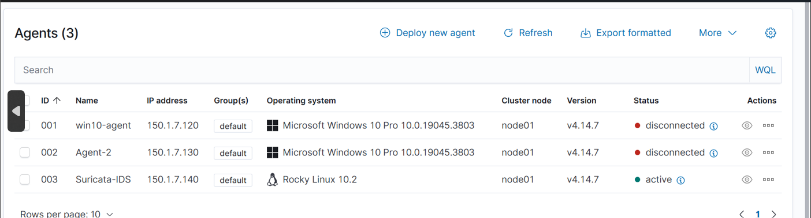
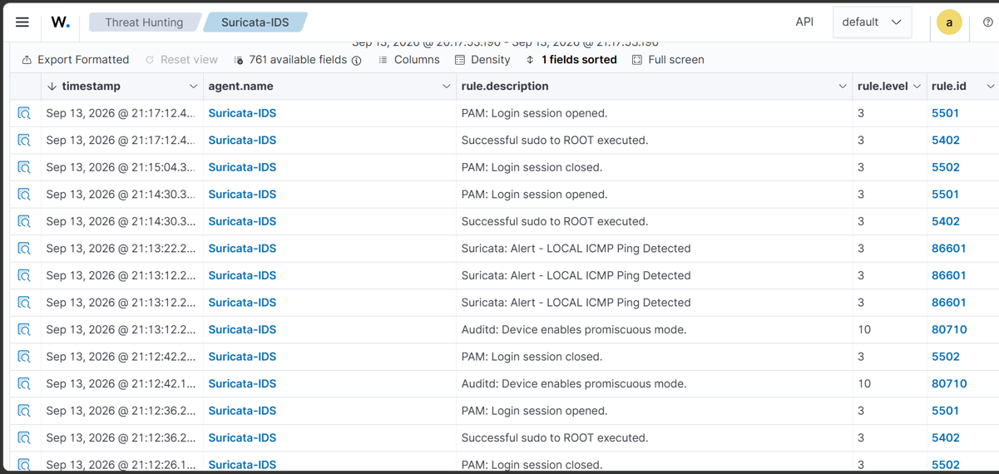
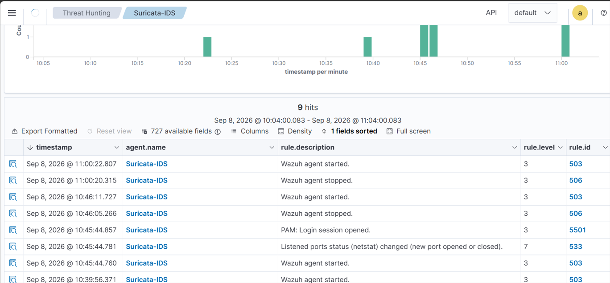

# Connecting a Wazuh Agent (Suricata Linux VM)

## Overview
A Wazuh agent runs on the Suricata VM, collects Suricata's `eve.json` logs,
and sends them to the Wazuh server. The events then appear in the Wazuh dashboard.

## Lab layout
| Component | Role |
|-----------|------|
| Wazuh server | Manager, indexer, dashboard |
| Suricata VM (Linux) | Network IDS + Wazuh agent |

## Prerequisites
- Wazuh server running with a static IP
  ([setup guide](https://github.com/spark077-code/wazuh-siem-home-lab/blob/main/docs/05-static-ip-config.md))
- Ports 1514/tcp (agent communication) and 1515/tcp (enrollment) open on the server
- Suricata installed and running on the agent VM
- Agent VM can reach the server: `ping <WAZUH_SERVER_IP>`

## Steps

### 1. Generate the install command
In the Wazuh dashboard, open **Agents > Deploy new agent**, then:
- Select the Linux package that matches the VM (DEB or RPM)
- Enter the Wazuh server IP as the server address
- Give the agent a name

### 2. Install the agent
Run the command generated by the dashboard on the Suricata VM.

### 3. Enable and start the agent
```bash
sudo systemctl daemon-reload
sudo systemctl enable --now wazuh-agent
```

### 4. Send Suricata logs to Wazuh
Add this block inside `<ossec_config>` in `/var/ossec/etc/ossec.conf` on the agent:
```xml
<localfile>
  <log_format>json</log_format>
  <location>/var/log/suricata/eve.json</location>
</localfile>
```
Restart the agent:
```bash
sudo systemctl restart wazuh-agent
```

## Verification
- Dashboard: **Agents** shows the agent as **Active**.
- On the server:
```bash
  sudo /var/ossec/bin/agent_control -l
```
- On the agent VM:
```bash
  sudo systemctl status wazuh-agent
  sudo tail -n 20 /var/ossec/logs/ossec.log
```
- Generate some test traffic and check that Suricata events appear in the Wazuh dashboard.

## Troubleshooting
| Problem | Check |
|---------|-------|
| Agent shows Disconnected | VM is powered on, server IP in the agent config, ports 1514/1515 |
| Agent cannot reach the server | Network mode (NAT/Bridged) is the same on both VMs, static IP is correct |
| No Suricata events | `eve.json` path is correct, Suricata service is running, agent was restarted |

> Note: if the agent VM is powered off, the agent simply shows as Disconnected.
> It reconnects automatically when the VM is back on.

## Screenshots

### Agent deployed


### Suricata events in Wazuh


### Events timeline


## Next
Custom Suricata rules: [02-custom-rules.md](02-custom-rules.md) (coming soon)
